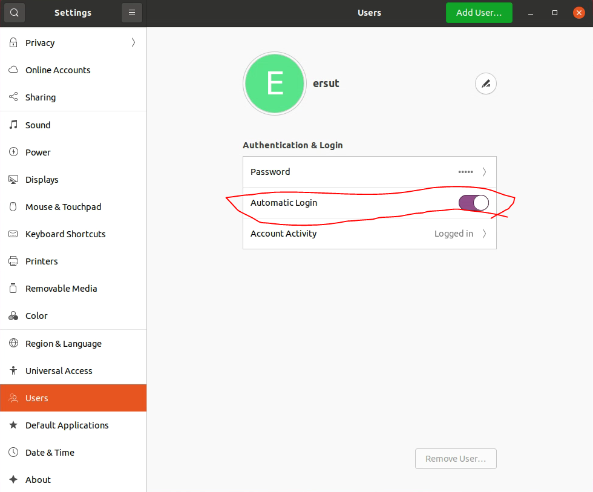
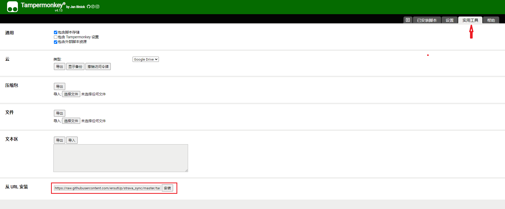
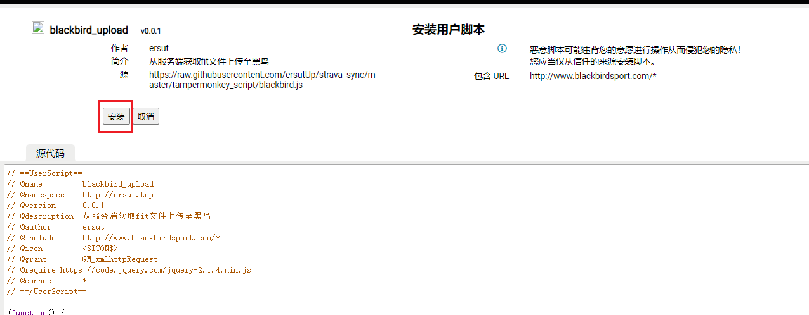
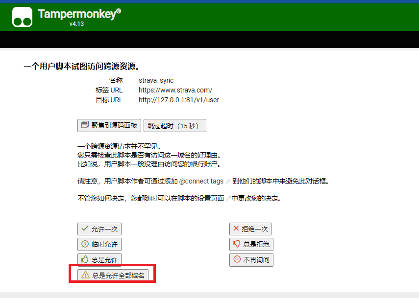

# strava记录同步至黑鸟与行者

> 目前支持佳明码表记录上传到黑鸟和行者，迈金码表记录不支持上传黑鸟，zwift记录不支持上传黑鸟

## 1、运行后台程序

### 修改server/fit_sync.db文件（设置strava、行者、黑鸟的账号密码）

1. 使用SQLite数据库可视化工具打开server/fit_sync.db文件中的user_infos表

2. 修改最后一条数据或添加一条

3. 各个字段的含义

	| 字段名             | 含义                 |
	| ------------------ | -------------------- |
	| id                 | id值                 |
	| strava_email       | strava的账号即邮箱   |
	| strava_pass        | strava的密码         |
	| before_day         | 获取近期多少天的记录 |
	| strava_sync_second | 多久同步一次数据     |
	| send_key           | server酱的秘钥       |
	| xz_account         | 行者账号             |
	| xz_pass            | 行者密码             |
	| blackbird_username | 黑鸟账号             |
	| blackbird_pass     | 黑鸟密码             |

### 编译程序

使用go命令编译程序`go build main.go`

### 自动启动

#### ubantu:

后端服务设置为服务并自启动：

```shell
#进入/etc/init.d目录
cd /etc/init.d
#新建脚本
touch strava-sync
#写入脚本命令
echo -e '#!/bin/sh\ncd /opt/strava && (nohup ./main 2>&1 &) > /dev/null' > ./strava-sync
#授权
chmod 777 ./strava-sync
#安装sysv-rc-conf管理服务
apt-get install -y sysv-rc-conf
#运行sysv-rc-conf，运行后为可视化管理
sysv-rc-conf
#设置strava-sync服务自动启动
systemctl enabled strava-sync.service
#重启
reboot
```

测试服务是否启动`wget -q -O - 127.0.0.1:81/v1/user`输出json串则服务启动成功

设置桌面浏览器自动启动

1. 免密码进入桌面，在设置中打开自动登录，详见下图

	

2. 火狐浏览器自动启动

	```shell
	#复制火狐浏览器启动器至 ~/.config/autostart/ 下
	mkdir ~/.config/autostart/ && cp /usr/share/applications/firefox.desktop ~/.config/autostart/
	```

3. 火狐浏览器自动打开黑鸟、行者、strava网站

	将项目中的start.html设置为浏览器首页

## 2、浏览器安装油猴（tampermonkey）插件

安装方法：https://www.tampermonkey.net/

## 3、往油猴插件内安装脚本

- strava脚本链接：https://raw.githubusercontent.com/ersutUp/strava_sync/master/tampermonkey_script/strava.js
- 黑鸟脚本链接：https://raw.githubusercontent.com/ersutUp/strava_sync/master/tampermonkey_script/blackbird.js
- 行者脚本链接：https://raw.githubusercontent.com/ersutUp/strava_sync/master/tampermonkey_script/xingzhe.js

### 安装方法

1. 安装复制链接安装脚本

	

	

2. 访问对应网站，授权跨域访问（点击总是允许全部域名）

	

以上3个脚本安装方法一样

## 4、可视化页面

- 近期50条数据同步列表：127.0.0.1:81/static/trainings.html 
	- 其中行者、黑鸟列为0时表示未同步，一般同步周期与 user_infos表中的strava_sync_second值一致
